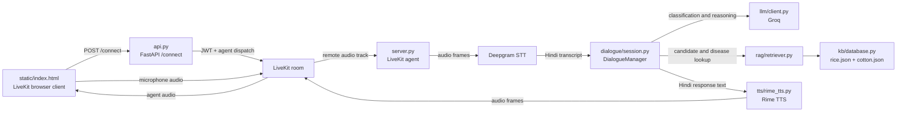

Created isolated worktree for branch `agents/first-release-readme-creation`

I’ll inspect the repository structure and entry points first, then draft the README preview without modifying files.

Find files matching `**/*`

Ran terminal command: git status --short; Write-Output '--- root ---'; Get-ChildItem -Force | Select-Object Mode,Length,Name

Search for `https?://|fetch\(|axios|supabase|firebase|import |from |require\(`

Read 
Completed with input: {
  "path": "C:\\Users\\shris\\OneDrive\\Desktop\\KDAG_HACKATHON.worktrees\\first-release-readme-creation\\README.md"
}

Read 
Completed with input: {
  "path": "C:\\Users\\shris\\OneDrive\\Desktop\\KDAG_HACKATHON.worktrees\\first-release-readme-creation\\api.py"
}

Read 
Completed with input: {
  "path": "C:\\Users\\shris\\OneDrive\\Desktop\\KDAG_HACKATHON.worktrees\\first-release-readme-creation\\server.py"
}

Read 
Completed with input: {
  "path": "C:\\Users\\shris\\OneDrive\\Desktop\\KDAG_HACKATHON.worktrees\\first-release-readme-creation\\dialogue\\session.py"
}

Read 
Completed with input: {
  "path": "C:\\Users\\shris\\OneDrive\\Desktop\\KDAG_HACKATHON.worktrees\\first-release-readme-creation\\rag\\retriever.py"
}

Read 
Completed with input: {
  "path": "C:\\Users\\shris\\OneDrive\\Desktop\\KDAG_HACKATHON.worktrees\\first-release-readme-creation\\rag\\ingest.py"
}

Read 
Completed with input: {
  "path": "C:\\Users\\shris\\OneDrive\\Desktop\\KDAG_HACKATHON.worktrees\\first-release-readme-creation\\kb\\database.py"
}

Read 
Completed with input: {
  "path": "C:\\Users\\shris\\OneDrive\\Desktop\\KDAG_HACKATHON.worktrees\\first-release-readme-creation\\llm\\client.py"
}

Read 
Completed with input: {
  "path": "C:\\Users\\shris\\OneDrive\\Desktop\\KDAG_HACKATHON.worktrees\\first-release-readme-creation\\tts\\rime_tts.py"
}

Read 
Completed with input: {
  "path": "C:\\Users\\shris\\OneDrive\\Desktop\\KDAG_HACKATHON.worktrees\\first-release-readme-creation\\static\\index.html"
}

Read 
Completed with input: {
  "path": "C:\\Users\\shris\\OneDrive\\Desktop\\KDAG_HACKATHON.worktrees\\first-release-readme-creation\\requirements.txt"
}

Read 
Completed with input: {
  "path": "C:\\Users\\shris\\OneDrive\\Desktop\\KDAG_HACKATHON.worktrees\\first-release-readme-creation\\.env.example"
}

Read , lines 1 to 220
Completed with input: {
  "path": "C:\\Users\\shris\\OneDrive\\Desktop\\KDAG_HACKATHON.worktrees\\first-release-readme-creation\\api.py",
  "view_range": [
    1,
    220
  ]
}

Read , lines 1 to 280
Completed with input: {
  "path": "C:\\Users\\shris\\OneDrive\\Desktop\\KDAG_HACKATHON.worktrees\\first-release-readme-creation\\dialogue\\session.py",
  "view_range": [
    1,
    280
  ]
}

Read , lines 1 to 280
Completed with input: {
  "path": "C:\\Users\\shris\\OneDrive\\Desktop\\KDAG_HACKATHON.worktrees\\first-release-readme-creation\\llm\\prompts.py",
  "view_range": [
    1,
    280
  ]
}

Read 
Completed with input: {
  "path": "C:\\Users\\shris\\OneDrive\\Desktop\\KDAG_HACKATHON.worktrees\\first-release-readme-creation\\static\\index.html"
}

Read 
Completed with input: {
  "path": "C:\\Users\\shris\\OneDrive\\Desktop\\KDAG_HACKATHON.worktrees\\first-release-readme-creation\\Dockerfile"
}

Read 
Completed with input: {
  "path": "C:\\Users\\shris\\OneDrive\\Desktop\\KDAG_HACKATHON.worktrees\\first-release-readme-creation\\tingting.py"
}

Read 
Completed with input: {
  "path": "C:\\Users\\shris\\OneDrive\\Desktop\\KDAG_HACKATHON.worktrees\\first-release-readme-creation\\test_cli.py"
}

Read 
Completed with input: {
  "path": "C:\\Users\\shris\\OneDrive\\Desktop\\KDAG_HACKATHON.worktrees\\first-release-readme-creation\\scratch_test.py"
}

The code shows two runtime surfaces: a FastAPI `/connect` service serving a browser client, and a LiveKit worker that streams Hindi audio through Deepgram, `DialogueManager`, Groq, and Rime. I’m checking the remaining client and dialogue details now so the diagram and structure reflect the actual release rather than the older README.

Read , lines 1 to 220
Completed with input: {
  "path": "C:\\Users\\shris\\OneDrive\\Desktop\\KDAG_HACKATHON.worktrees\\first-release-readme-creation\\static\\index.html",
  "view_range": [
    1,
    220
  ]
}

Read , lines 221 to 500
Completed with input: {
  "path": "C:\\Users\\shris\\OneDrive\\Desktop\\KDAG_HACKATHON.worktrees\\first-release-readme-creation\\static\\index.html",
  "view_range": [
    221,
    500
  ]
}

Read , lines 191 to 260
Completed with input: {
  "path": "C:\\Users\\shris\\OneDrive\\Desktop\\KDAG_HACKATHON.worktrees\\first-release-readme-creation\\api.py",
  "view_range": [
    191,
    260
  ]
}

Read , lines 176 to 360
Completed with input: {
  "path": "C:\\Users\\shris\\OneDrive\\Desktop\\KDAG_HACKATHON.worktrees\\first-release-readme-creation\\dialogue\\session.py",
  "view_range": [
    176,
    360
  ]
}

Read , lines 55 to 180
Completed with input: {
  "path": "C:\\Users\\shris\\OneDrive\\Desktop\\KDAG_HACKATHON.worktrees\\first-release-readme-creation\\README.md",
  "view_range": [
    55,
    180
  ]
}

Search for `livekit\.|LiveKit|deepgram|Deepgram|rime|Rime|Groq|FastAPI|Chroma|SentenceTra...`

# FasalVachak

## Description

FasalVachak is a Hindi voice assistant for diagnosing rice and cotton crop diseases. It connects farmers to a LiveKit voice agent that transcribes speech, reasons over a curated disease knowledge base, and responds with spoken guidance.

## Architecture diagram



[`static/index.html`](./static/index.html) requests a short-lived LiveKit token from [`api.py`](./api.py), then joins a unique room. [`server.py`](./server.py) receives the farmer’s audio, sends it through Deepgram and [`dialogue/session.py`](./dialogue/session.py), and publishes the Rime-generated response back to the browser. The dialogue manager uses [`llm/client.py`](./llm/client.py) and the in-memory knowledge base loaded by [`kb/database.py`](./kb/database.py).

## Interesting techniques

- **State-machine dialogue flow:** [`DialogueManager`](./dialogue/session.py) separates crop detection, symptom diagnosis, follow-up questions, and completed calls.
- **Closed-list diagnosis:** [`rag/retriever.py`](./rag/retriever.py) supplies the complete set of diseases for a crop instead of relying on an unrestricted model response.
- **Structured LLM outputs:** [`llm/prompts.py`](./llm/prompts.py) requires explicit `ANALYSIS`, `ACTION`, and `CONTENT` fields for diagnosis decisions.
- **Asynchronous audio streaming:** [`server.py`](./server.py) concurrently pushes LiveKit audio frames to speech recognition and consumes final transcripts.
- **Browser media handling:** [`static/index.html`](./static/index.html) uses [`MediaStream`](https://developer.mozilla.org/en-US/docs/Web/API/MediaStream) and [`HTMLMediaElement.play()`](https://developer.mozilla.org/en-US/docs/Web/API/HTMLMediaElement/play) to attach agent audio while respecting browser autoplay policies.
- **Short-lived access tokens:** [`api.py`](./api.py) creates ten-minute LiveKit JWTs scoped to microphone publishing and room subscription.

## Notable technologies and libraries

- [Python](https://www.python.org/) 3.12
- [FastAPI](https://fastapi.tiangolo.com/) and [Uvicorn](https://www.uvicorn.org/) for the token, dispatch, health, and static-file HTTP service
- [LiveKit](https://livekit.io/) and [livekit-agents](https://docs.livekit.io/agents/) for real-time voice rooms and agent workers
- [LiveKit JavaScript client](https://github.com/livekit/client-sdk-js), loaded from [jsDelivr](https://www.jsdelivr.com/), for browser room connections
- [Deepgram](https://deepgram.com/) Nova-2 Hindi speech-to-text
- [Rime](https://rime.ai/) Coda Hindi text-to-speech
- [Groq](https://groq.com/) with the `openai/gpt-oss-120b` model for crop classification, intent checks, symptom summarization, and diagnosis reasoning
- [ChromaDB](https://www.trychroma.com/) and [Sentence Transformers](https://www.sbert.net/) in [`rag/ingest.py`](./rag/ingest.py) for optional symptom-vector indexing
- [aiohttp](https://docs.aiohttp.org/) for asynchronous TTS HTTP sessions
- [python-dotenv](https://github.com/theskumar/python-dotenv) for environment configuration
- The browser UI uses the system [`Segoe UI`](https://learn.microsoft.com/en-us/typography/font-list/segoe-ui) font with a system fallback stack.

## Project structure

```text
.
├── .dockerignore
├── .env.example
├── .gitignore
├── Dockerfile
├── README.md
├── api.py
├── requirements.txt
├── scratch_test.py
├── server.py
├── test_cli.py
├── test_out.txt
├── tingting.py
├── dialogue/
├── kb/
├── llm/
├── rag/
├── static/
└── tts/
```

- [`dialogue/`](./dialogue/) contains the conversation state machine.
- [`kb/`](./kb/) contains the crop disease data and loader.
- [`llm/`](./llm/) contains Groq client code and prompt templates.
- [`rag/`](./rag/) contains candidate retrieval and optional ChromaDB ingestion.
- [`static/`](./static/) contains the browser client served by [`api.py`](./api.py).
- [`tts/`](./tts/) contains the Rime text-to-speech integration.